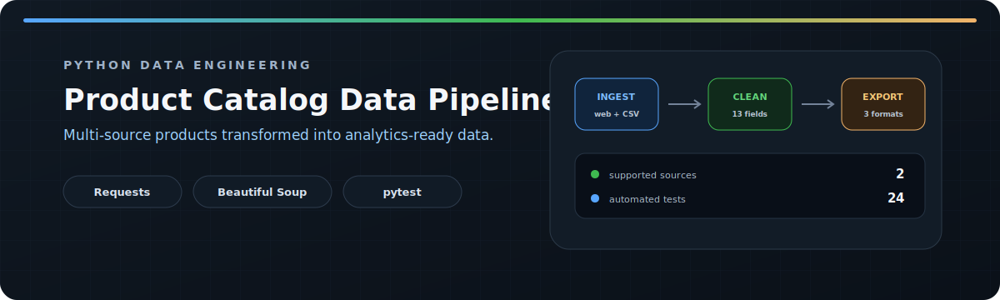
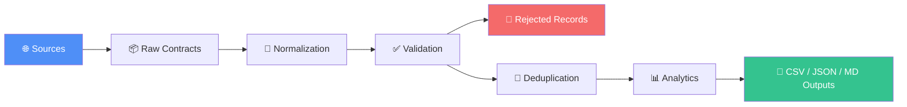

<div align="center">
  
</div>

<br>

<div align="center">

# 🛒 Product Catalog Data Pipeline

**A multi-source Python ETL pipeline that turns messy product data into clean, validated, analytics-ready datasets.**

[](https://www.python.org/)
[](#-testing)
[](LICENSE)
[](#-purpose)

</div>

---

## 📌 Overview

This project is an end-to-end data engineering exercise: it scrapes and ingests product data from **unrelated sources**, forces it into a **single normalized schema**, validates it, deduplicates it, computes analytics, and exports clean **CSV / JSON / Markdown** reports.



---

## 📚 Table of Contents

- [Features](#-features)
- [Supported Sources](#-supported-sources)
- [Normalized Record Schema](#-normalized-record-schema)
- [Pipeline Architecture](#-pipeline-architecture)
- [Installation](#-installation)
- [Usage](#-usage)
- [CLI Options](#-cli-options)
- [Outputs](#-outputs)
- [Example Run](#-example-run)
- [Testing](#-testing)
- [Reliability](#-reliability)
- [Project Structure](#-project-structure)
- [Current Limitations](#-current-limitations)
- [Possible Extensions](#-possible-extensions)
- [Purpose](#-purpose)
- [License](#-license)

---

## ✨ Features

| Feature | Description |
|---|---|
| **Multi-page scraping** | Live crawl of [Books to Scrape](https://books.toscrape.com/) |
| **Amazon CSV ingestion** | Local dataset support with configurable path |
| **Shared raw contract** | One structure for unrelated sources |
| **Deep normalization** | Text, price, currency, availability, rating, category, URL |
| **UTC timestamps** | Consistent across a single pipeline run |
| **Field-level validation** | Reusable, stable error codes |
| **Rejected-record tracking** | Raw *and* normalized values preserved |
| **Stable deduplication** | Based on source ID and product URL — never titles |
| **Per-source / per-currency analytics** | No cross-currency averaging |
| **CSV, JSON & Markdown exports** | Ready for downstream use |
| **CLI with input validation** | Safe, scriptable, `argparse`-driven |
| **UTC logging** | Terminal + `logs/log.txt` |
| **24-test automated suite** | Core pipeline stages covered |

---

## 🌍 Supported Sources

### 📖 Books to Scrape (web)

- Multi-page scraping
- Request timeout + HTTP-status validation
- Safe request-error handling
- Title, price, availability, rating, URL extraction
- Relative → absolute URL conversion

### 🛒 Amazon (CSV)

Expected source columns:

```text
asin, title, brand, categories,
final_price, currency, availability,
rating, url
```

> ⚠️ The raw dataset is excluded from Git.
> Sample data: [Bright Data eCommerce samples](https://github.com/luminati-io/eCommerce-dataset-samples)
>
> Place at: `data/raw/amazon-products.csv`
> or pass a custom path via `--amazon-csv`

---

## 🧬 Normalized Record Schema

Every accepted product — regardless of source — is converted into the same **13-field schema**:

| Field | Type | Description |
|---|---|---|
| `source` | `str` | Source adapter identifier |
| `source_id` | `str \| null` | Stable source-specific product ID |
| `title` | `str` | Normalized product title |
| `brand` | `str \| null` | Product brand |
| `category` | `str \| null` | Most specific normalized category |
| `price_raw` | `str \| null` | Original price representation |
| `price` | `float \| null` | Parsed numeric price |
| `currency` | `str \| null` | Three-letter uppercase currency code |
| `availability_raw` | `str \| null` | Original availability text |
| `availability` | `str` | `in_stock`, `out_of_stock`, or `unknown` |
| `rating` | `float \| null` | Numeric product rating |
| `product_url` | `str \| null` | Absolute product URL |
| `collected_at` | `str` | ISO-8601 UTC batch timestamp |

📄 Full schema rationale: [`docs/product_schema.md`](docs/product_schema.md)

---

## 🏗️ Pipeline Architecture

<details>
<summary><strong>1️⃣ Source adapters</strong> — click to expand</summary>

Each source returns a shared raw structure:

```text
source_id_raw     title_raw        brand_raw
category_raw      price_raw        currency_raw
availability_raw  rating_raw       product_url_raw
```

Unavailable source fields stay present with `None` values.
</details>

<details>
<summary><strong>2️⃣ Raw contract validation</strong></summary>

Records with missing or unexpected raw keys are rejected **before** normalization even begins.
</details>

<details>
<summary><strong>3️⃣ Normalization</strong></summary>

- External and repeated internal whitespace
- Empty values
- Currency symbols and quoted prices
- Three-letter currency codes
- Availability phrases
- Word-based and numeric ratings
- JSON category paths
- Relative product URLs
- UTC collection timestamps
</details>

<details>
<summary><strong>4️⃣ Validation</strong></summary>

Checks: required source/title · non-negative prices · three-letter uppercase currency format · canonical availability · rating range 0–5 · absolute HTTP(S) URLs · valid UTC timestamps.

Stable error codes:

```text
missing_title  invalid_price       invalid_currency
invalid_availability  invalid_rating
invalid_product_url   invalid_collected_at
```
</details>

<details>
<summary><strong>5️⃣ Deduplication</strong></summary>

Identity resolved in this priority order:

1. `source + source_id`
2. `product_url`
3. No reliable identity → **record is preserved**, not dropped

> Titles are never used as identity — different products can share the same name.
</details>

<details>
<summary><strong>6️⃣ Analytics</strong></summary>

- Total record count
- Records by source
- Availability distribution
- Currency distribution
- Per-currency price count / min / max / average
- Average rating
- Missing-value counts

> Prices from different currencies are **never** combined into one average.
</details>

---

## ⚙️ Installation

```powershell
git clone https://github.com/Mr-sanabi/product-catalog-data-pipeline.git
cd product-catalog-data-pipeline

python -m venv .venv
.\.venv\Scripts\Activate.ps1

pip install -r requirements.txt        # runtime
pip install -r requirements-dev.txt    # dev + testing
```

On Linux or macOS, activate the environment with:

```bash
source .venv/bin/activate
```

**Runtime dependencies:** `requests`, `beautifulsoup4`

---

## 🚀 Usage

```powershell
python -m src.main --help
```

### Books only

```powershell
python -m src.main --book-pages 2
```

### Amazon CSV only

```powershell
python -m src.main `
  --amazon-csv data/raw/amazon-products.csv `
  --amazon-limit 100
```

### Combined pipeline

```powershell
python -m src.main `
  --book-pages 2 `
  --amazon-csv data/raw/amazon-products.csv `
  --amazon-limit 100
```

### Custom output paths

```powershell
python -m src.main `
  --book-pages 1 `
  --csv-output output/products.csv `
  --json-output output/pipeline_result.json `
  --report-output output/report.md
```

---

## 🎛️ CLI Options

| Option | Default | Description |
|---|---|---|
| `--book-pages` | `0` | Number of Books pages; `0` disables the source |
| `--amazon-csv` | `None` | Path to the Amazon CSV dataset |
| `--amazon-limit` | `None` | Maximum Amazon rows to load |
| `--csv-output` | `data/processed/products.csv` | Normalized CSV output |
| `--json-output` | `data/processed/pipeline_result.json` | Complete JSON result |
| `--report-output` | `reports/pipeline_report.md` | Markdown analytics report |

> ℹ️ At least one source must be selected. Invalid numeric arguments are rejected by `argparse` before the pipeline starts.

---

## 📤 Outputs

### 📄 CSV

Final, validated, deduplicated records in stable column order.

`data/processed/products.csv`

### 🧾 JSON

```text
records
rejected_records
analysis
pipeline_stats
```

`data/processed/pipeline_result.json`

### 📝 Markdown report

Run summary · source breakdown · availability & currency breakdown · price stats · avg rating · missing-value stats

`reports/pipeline_report.md`

> Generated outputs are Git-ignored. A stable example is available at [`docs/example_report.md`](docs/example_report.md).

---

## 🧪 Example Run

**Input:** 1 Books page + 5 Amazon CSV rows

```text
Raw records:              25
Valid before dedup:       25
Rejected records:          0
Duplicates removed:        0
Final records:             25
```

*(Exact numbers vary with the selected pages / rows.)*

### Rejected record example

```json
{
  "raw_record": {},
  "normalized_record": null,
  "errors": ["invalid_raw_contract"]
}
```

When normalization succeeds but validation fails, **both** the raw and normalized forms are kept for inspection.

---

## ✅ Testing

```powershell
python -m pytest -q
```

```text
24 passed ✔
```

Covers normalization · validation · deduplication · analytics · pipeline acceptance/rejection paths · CSV & JSON writers · empty-CSV edge cases.

Run a single module:

```powershell
python -m pytest tests/test_validator.py -v
```

---

## 🛡️ Reliability

Request timeouts · `raise_for_status()` checks · `RequestException` handling · CSV & filesystem error handling · safe empty-source behavior · warning logs for empty datasets · graceful output-write failure (exit code `1`) · automatic output-directory creation · UTF-8 file handling · UTC logging.

Logs: `logs/log.txt`

---

## 🗂️ Project Structure

```text
product-catalog-data-pipeline/
├── data/
│   ├── raw/
│   └── processed/
├── docs/
│   ├── example_report.md
│   └── product_schema.md
├── logs/
├── reports/
├── src/
│   ├── sources/
│   │   ├── books_source.py
│   │   ├── contracts.py
│   │   └── csv_source.py
│   ├── analyzer.py
│   ├── deduplicator.py
│   ├── logging_config.py
│   ├── main.py
│   ├── normalizer.py
│   ├── pipeline.py
│   ├── report.py
│   ├── validator.py
│   └── writer.py
├── tests/
│   ├── test_analyzer.py
│   ├── test_deduplicator.py
│   ├── test_normalizer.py
│   ├── test_pipeline.py
│   ├── test_validator.py
│   └── test_writer.py
├── .gitignore
├── LICENSE
├── README.md
├── requirements.txt
└── requirements-dev.txt
```

---

## 🚧 Current Limitations

- Amazon data must be provided as a local CSV file
- Price parsing targets English-style numeric formatting
- Currency values are normalized but not converted
- Books scraping depends on the current HTML structure of the demo site
- CLI-based only — no database, API, scheduler, or UI
- Records without a stable ID/URL are preserved rather than auto-deduplicated

## 🗺️ Possible Extensions

- [ ] Additional CSV and web source adapters
- [ ] Configurable source mappings
- [ ] Retry and backoff policies
- [ ] Currency conversion with exchange-rate metadata
- [ ] SQLite / PostgreSQL storage
- [ ] Scheduled pipeline runs
- [ ] HTML report generation
- [ ] CI test execution via GitHub Actions

---

## 🎯 Purpose

Built as a **portfolio-grade data engineering exercise** focused on turning heterogeneous product sources into validated, auditable, reusable structured data — covering source-adapter design, schema contracts, normalization, validation/rejection workflows, stable deduplication, analytics, CLI orchestration, automated testing, and multi-format reporting.

---

## 📄 License

This project is licensed under the [MIT License](LICENSE).

<div align="center">

---

Made with 🐍 Python · tested with 🧪 pytest

</div>
